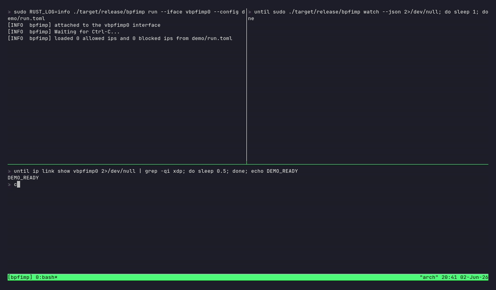

[](https://github.com/cbass-d/bpfimp/actions/workflows/build.yml)

# bpfimp

An XDP-based packet rate limiter written in Rust with [aya]. Traffic is
classified per source IP and metered against a token bucket in the kernel.
A small userspace control plane hot-reloads allow/block lists from disk,
snapshots live state on demand, and streams drop events over a ring buffer.
Handles both IPv4 and IPv6.

> Status: working demo. Tested against a veth/netns harness.

## Demo



A single source IP is flooded with 500 packets under three policies, with no
restart between them — the userspace control plane (top-left) hot-reloads each
change and drop events stream live over the ring buffer (top-right):

1. **Unknown peer** — rate-limited by a token bucket: ~138/500 pass
   (100 starting tokens + ~10/s refill over the flood).
2. **Blocklisted** — every packet is `XDP_DROP`'d at the blocklist: ~100% loss.
3. **Allowlisted** — a larger bucket plus reputation scoring: ~240/500 pass.

The recording is scripted with [vhs]; regenerate it with `vhs demo/demo.tape`
(see the header of [`demo/demo.tape`](demo/demo.tape) for prerequisites — a
release build and passwordless sudo for the duration of the capture).

## What it does

For every IPv4 or IPv6 packet arriving on the attached interface, the XDP
program:

1. Looks the source IP up in the **blocklist** map
   (`BLOCKED_BUCKETS_V4` / `BLOCKED_BUCKETS_V6`). A hit drops the packet and
   bumps a per-entry hit counter.
2. Otherwise increments a per-source-IP packet counter
   (`PKT_COUNTS_V4` / `PKT_COUNTS_V6`).
3. Looks the source up in one of two LRU maps:
   - **Allowed peers** (`ALLOWED_BUCKETS_V4` / `ALLOWED_BUCKETS_V6`) — IPs
     loaded from `bpfimp.toml`. Each has a token bucket *and* a reputation
     score. The score gates the bucket: an IP only passes if
     `score >= MIN_SCORE_TO_PASS` *and* a token is available. Successful
     packets nudge the score up (capped at `MAX_SCORE`); a denied packet
     subtracts `PENALTY`. This lets a trusted peer absorb a burst but get
     throttled if it sustains abuse.
   - **Unknown IPs** (`UNK_BKTS_V4` / `UNK_BKTS_V6`) — auto-inserted with a
     smaller starting balance (`NEW_MAX_TOKENS`) and a plain token bucket.
4. Returns `XDP_PASS` or `XDP_DROP` based on the result. On every drop
   (blocklist hit *or* an empty bucket) it also pushes a compact event record
   onto a ring buffer (`EVENTS`) that userspace can stream live — see
   [`watch`](#cli).

IPv4 and IPv6 are tracked in independent map families; a peer that appears
under both families gets two independent buckets and reputations.

> Map names are capped at 16 characters by the kernel, which is why the
> in-tree names are abbreviated (`PKT_COUNTS_V4`, `UNK_BKTS_V4`) rather than
> spelled out.

Userspace (`bpfimp`) loads the program, attaches it to `--iface`, and watches
`bpfimp.toml` with a debounced filesystem notifier so edits take effect
without a restart.

## Architecture

```
                  kernel  |  user
                          |
   NIC ── XDP hook ───────|
        │                 |
        ▼                 |
   BLOCKED_BUCKETS_V{4,6} ◄──|──┐
        │                 |    │
        ▼                 |    ├── bpfimp.toml  (notify + debouncer)
   PKT_COUNTS_V{4,6}      |    │
        │                 |    │
        ▼                 |    │
   ALLOWED_BUCKETS_V{4,6} ◄──|─┘
   UNK_BKTS_V{4,6}        |
        │                 |
        ▼                 |
   XDP_PASS / XDP_DROP    |
        │                 |
        └─ on drop ──► EVENTS ringbuf ──|──► bpfimp watch  (live JSONL stream)
```

The three crates split cleanly: `bpfimp-ebpf` is the `no_std` kernel program,
`bpfimp` is the Tokio-based loader, and `bpfimp-common` holds the POD types
(`TokenBucket`, `Reputation`, `BlockedEntry`, and the `ImpEvent` wire record)
plus the policy constants shared by both sides.

## Persistence

The **policy** maps — `ALLOWED_BUCKETS_V{4,6}` and `BLOCKED_BUCKETS_V{4,6}` —
are pinned to bpffs under `/sys/fs/bpf/bpfimp/`. They are declared with
`pinned(...)` on the kernel side and opened through
`EbpfLoader::map_pin_path("/sys/fs/bpf/bpfimp")`, so on startup the loader
reuses an existing pin when one is present and creates+pins a fresh map
otherwise. As a result **reputation scores and block-hit counters survive a
`bpfimp run` restart** — they are *not* zeroed on reload.

The **telemetry** maps — `PKT_COUNTS_V{4,6}` and `UNK_BKTS_V{4,6}` — are *not*
pinned. They live only while the program is loaded and are cleared when
`bpfimp run` exits, so per-IP packet totals and auto-tracked unknown buckets
reset on restart. (`EVENTS` is a ring buffer and is likewise transient.)

> Note: bpffs is a kernel-memory filesystem, so **all** pins — and the
> directory itself — are wiped on reboot. Pinning persists state across
> *process* restarts within a boot, not across reboots.

To wipe the persisted policy state, remove the pins:

```shell
sudo rm -rf /sys/fs/bpf/bpfimp
```

## Quickstart

Prerequisites:

- Rust stable + nightly (`rustup toolchain install stable nightly --component rust-src`)
- `bpf-linker` (`cargo install bpf-linker`)
- A Linux kernel with XDP support (most distros, 5.x+)

A self-contained veth/netns harness ships in `scripts/`:

```shell
# 1. Create the test netns + veth pair (host 10.200.0.1, peer 10.200.0.2)
sudo ./scripts/setup_netns.sh

# 2. Build and attach the XDP program to the host veth
sudo ./scripts/run_bpfimp.sh

# 3. In another shell, generate traffic
sudo ./scripts/gen_traffic.sh         # 20 v4 pings at 1/s — should all pass
sudo ./scripts/gen_traffic.sh burst   # v4 flood — bucket drains, drops appear
sudo ./scripts/gen_traffic.sh ping6   # same against the v6 ULA (fd00:200::1)
sudo ./scripts/gen_traffic.sh burst6  # v6 flood

# 4. Tear it all down
sudo ./scripts/teardown_netns.sh
```

The attached eBPF logs (`RUST_LOG=info`) show individual `packet dropped` lines
as the bucket empties during the flood. For a structured feed of the same
drops, run `bpfimp watch --json` in a third shell while the flood is going:

```shell
sudo bpfimp watch --json
# {"type":"drop","ts_ns":1234567890,"ip":"10.200.0.2","ip_version":4}
```

The harness assigns both an IPv4 (`10.200.0.0/24`) and an IPv6 ULA
(`fd00:200::/64`) address to each end of the veth, so both code paths are
exercised. Router advertisements and autoconf are disabled on the test
interfaces to keep address state deterministic.

## Configuring allow/block lists

`bpfimp.toml` lists IPs to reputation-track (`allowlist`) or drop outright
(`blocklist`). Both IPv4 and IPv6 addresses are accepted; entries are
dispatched into the right map family based on the parsed address type:

```toml
allowlist = [
    "10.200.0.2",
    "2001:db8::50",
]
blocklist = [
    "192.168.1.50",
    "2001:db8::dead",
]
```

Edits are picked up live — the userspace watcher debounces filesystem events
and reconciles both lists against the kernel maps on save. The reconcile is a
set diff: IPs removed from the file are deleted from their map, newly-added IPs
are inserted, and IPs that are still listed are left untouched — so an allowed
peer keeps its accumulated reputation across edits instead of being reset.

## Policy knobs

The rate-limit constants live in [`bpfimp-common/src/lib.rs`](bpfimp-common/src/lib.rs)
and apply uniformly to both v4 and v6:

| Constant            | Default | Meaning                                                       |
| ------------------- | ------- | ------------------------------------------------------------- |
| `MAX_TOKENS`        | 200     | Bucket cap for established (allowed) peers                    |
| `NEW_MAX_TOKENS`    | 100     | Starting balance for newly-seen unknown IPs                   |
| `REFILL_PER_SEC`    | 10      | Tokens replenished per second                                 |
| `MAX_SCORE`         | 100     | Cap on reputation score                                       |
| `MIN_SCORE_TO_PASS` | 20      | Score floor below which an allowed peer is dropped            |
| `PENALTY`           | 10      | Score subtracted on a denied packet                           |

With the defaults a steady rate above ~10 pkt/s will eventually empty an
unknown IP's bucket; an allowed peer with a healthy score absorbs bursts up to
200 packets before throttling.

## CLI

`bpfimp` is subcommand-based and must be run as root:

```
bpfimp run --iface <NAME> [--config <PATH>]

  -i, --iface   interface to attach XDP to (required)
  -c, --config  path to bpfimp.toml (default: ./bpfimp.toml)

bpfimp inspect [--json]
bpfimp watch   [--json]
```

- **`run`** loads and attaches the XDP program, then watches the config file
  and reconciles the allow/block lists on every save.
- **`inspect`** dumps a snapshot of the current state — allowed-peer reputation
  scores and tokens, blocked-IP hit counts, per-IP packet totals, and the set
  of auto-tracked unknown IPs. Pass `--json` for machine-readable output. It
  reads the pinned policy maps *and* the live telemetry maps, so it **requires a
  running `bpfimp run` instance** (it exits with "bpfimp does not appear to be
  running" otherwise).
- **`watch`** tails a live feed of drop events streamed from the `EVENTS` ring
  buffer of a running instance, printing one record per drop. `--json` emits
  newline-delimited JSON (JSONL), suitable for piping into `jq` or a log
  shipper; without it, a short human-readable line per event. A ring buffer is
  single-consumer, so run one `watch` at a time.

`RUST_LOG=info` (or `debug`/`trace`) controls log verbosity.

## Limitations

- **Reputation doesn't decay over time** — a penalized IP that goes silent
  stays penalized until evicted from the LRU map.
- **v4 and v6 of the same peer are tracked independently** — no cross-family
  association.
- XDP attach defaults to native mode; on interfaces that don't support it
  (some virtio configs), switch to `XdpFlags::SKB_MODE` in
  `bpfimp/src/main.rs`.

## License

With the exception of eBPF code, bpfimp is distributed under the terms of
either the [MIT license] or the [Apache License] (version 2.0), at your option.

All eBPF code is distributed under either the terms of the
[GNU General Public License, Version 2] or the [MIT license], at your option.

[aya]: https://github.com/aya-rs/aya
[vhs]: https://github.com/charmbracelet/vhs
[Apache license]: LICENSE-APACHE
[MIT license]: LICENSE-MIT
[GNU General Public License, Version 2]: LICENSE-GPL2
